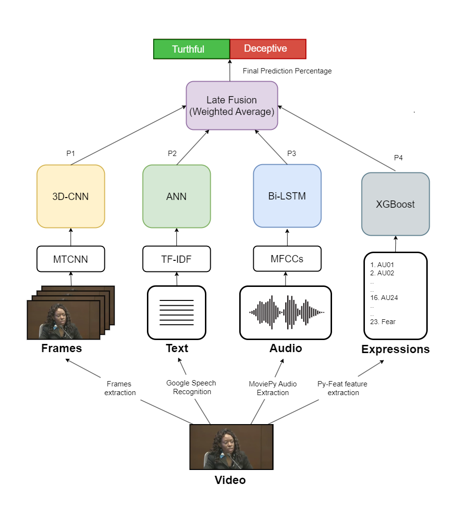

# Multimodal Deception Detection System

## Introduction

Deception detection is critical in high-stakes environments such as police investigations and airport security. Traditional methods, like polygraph tests, are often unreliable, require human expertise, and are prone to error and manipulation. Our project aims to address these limitations by leveraging a multimodal AI system that integrates visual, acoustic, and linguistic data to detect deception with high accuracy.

## Dataset

We used the Real-life Deception Detection Dataset consisting of 121 video clips from courtroom trials. This dataset includes 61 deceptive and 60 truthful clips, annotated with micro-expressions and transcriptions. Some challenges, such as multiple subjects in videos and data corruption, were manually rectified. To mitigate bias, we carefully manually split the dataset to avoid overlapping subjects between training and test sets and to ensure balanced gender distribution.

## Implementation

### Preprocessing

- **Video Frames:** Each video was processed as a single input, downsampled for consistency, and micro-expressions were extracted using Py-Feat.
- **Text:** Transcriptions were cleaned and vectorized using TF-IDF or GloVe.
- **Audio:** MFCC features were extracted from audio signals to analyze deceptive patterns.

### Model Architecture

Our system employed late fusion of multiple models:

- **Video Frames Modality:** Utilized CNN-LSTM and 3D CNN architectures to capture spatial and temporal features.
- **Micro Expressions Modality:** Machine learning classifiers (e.g., SVM, Decision Tree) were used on features extracted with Py-Feat.
- **Text Modality:** Basic ANN and machine learning models (e.g., SVM, SGD) analyzed vectorized text data.
- **Audio Modality:** RNNs (GRUs, LSTMs) were employed to detect vocal cues from MFCC sequences.

### Data Fusion

We experimented with late fusion techniques to combine predictions from all modalities, resulting in improved accuracy.

## Results

Our multimodal approach achieved significant improvements over unimodal methods:

| Modality    | Model   | Accuracy |
| ----------- | ------- | -------- |
| Video       | 3D-CNN  | 87.5%    |
| Expressions | XGBoost | 75%      |
| Text        | ANN     | 79.1%    |
| Audio       | Bi-LSTM | 79.1%    |

| Late Fusion Technique | Features | Accuracy |
| --------------------- | -------- | -------- |
| Weighted average      | A+V+T    | 91.6%    |
| Majority Voting       | A+V+T    | 95.8%    |

### Comparison to Previous Works

Our system outperforms several state-of-the-art approaches:

| Citation                    | Dataset             | Methodology                                              | Accuracy  |
| --------------------------- | ------------------- | -------------------------------------------------------- | --------- |
| Şen et al. (2020)           | Real Life Deception | Late fusion with visual, vocal, and linguistic features  | 83%       |
| Ahmed et al. (2021)         | Real Life Deception | FACS with LSTM                                           | 89.4%     |
| Mathur & Matarić (2020)     | Real Life Deception | Visual and vocal features with Ada-Boost                 | 84%       |
| Krishnamurthy et al. (2018) | Real Life Deception | Early fusion with visual, vocal, and linguistic features | 96.1%     |
| Yang et al. (2020)          | Real Life Deception | EST, ME, and IS13 features with logistic regression      | 92.7%     |
| **Proposed Method**         | Real Life Deception | Late fusion with visual, vocal, and linguistic features  | **95.8%** |

## Drawbacks

Despite promising results, our system has several limitations:

- **Overfitting Risk:** Small dataset and multiple deep learning models.
- **Computational Intensity:** High processing time for predictions.
- **Environment Specificity:** Models are trained for courtroom environments and may perform less accurately in other settings.

## Conclusion

Our multimodal deception detection system shows significant advancements in accuracy over traditional and unimodal approaches, leveraging a combination of visual, acoustic, and linguistic data. Future work will focus on addressing overfitting, reducing computational demands, and testing the system in diverse environments.
